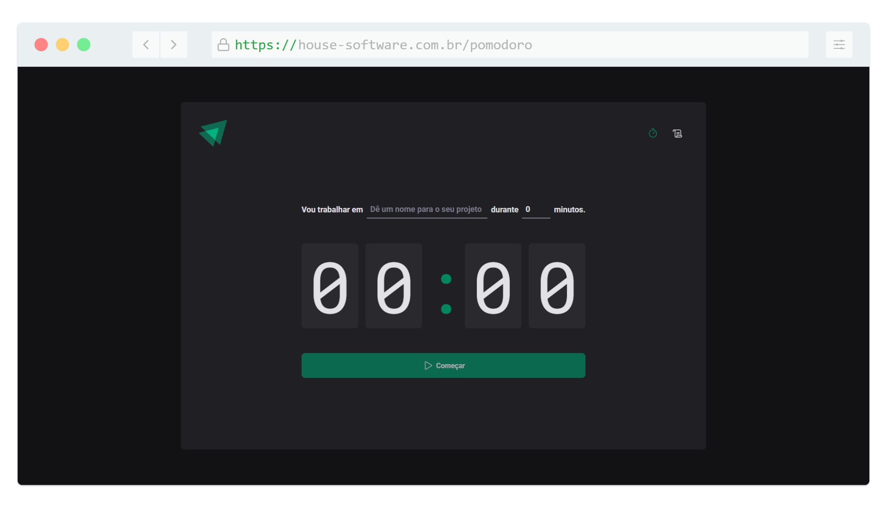
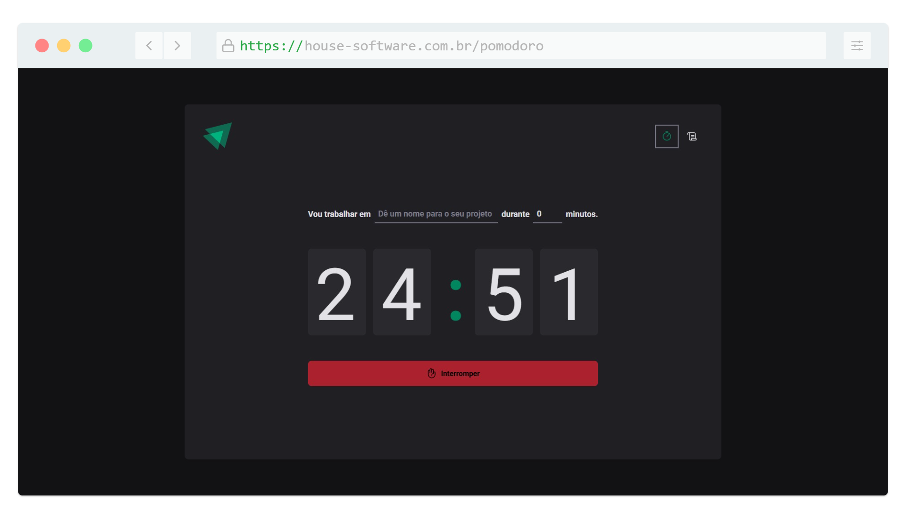
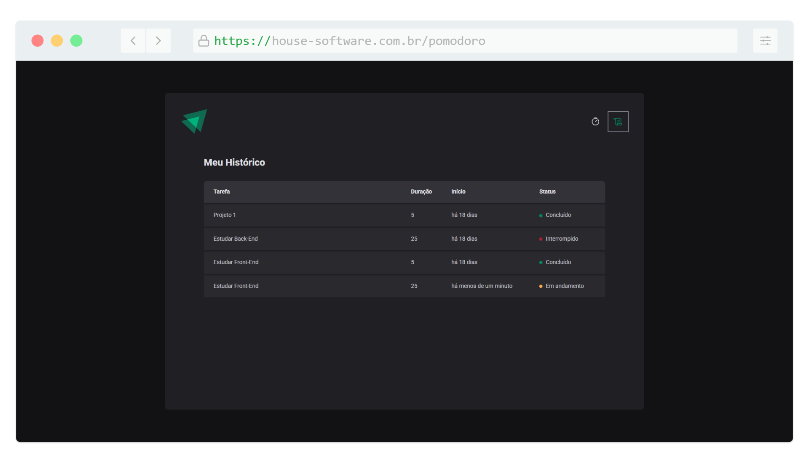

<h1 align="center">
   
</h1>

<h4 align="center"> 
	🚧 Pomodoro 🚀 Concluido... 🚀
</h4>

## ✅ Funções

- <h3>Pomodoro</h3>

  - [x] Iniciar pomodoro
  - [x] Parar pomodoro

- <h3>Listar Histórico</h3>

  - [x] Listar Histórico

## 📚 Descrição

⏳💻 Novo Projeto no Portfólio: Pomodoro Timer em React! 🚀

A cada dia, busco aprimorar minhas habilidades em React, e dessa vez desenvolvi um Pomodoro Timer para otimizar minha produtividade e monitorar meu tempo de estudo! 📚⏲️

O método Pomodoro é uma técnica de gestão de tempo que ajuda a manter o foco e a produtividade ao dividir o trabalho em blocos de tempo, geralmente 25 minutos de foco, seguidos por curtos intervalos.

🛠️ Tecnologias utilizadas:
🔹 ReactJS ⚛️ – Framework poderoso para interfaces dinâmicas
🔹 Styled Components 🎨 – Estilização moderna e componentizada
🔹 sessionStorage 💾 – Para armazenar os dados das sessões diretamente no navegador

💡 Funcionalidades do meu Pomodoro:
✅ Iniciar e pausar o tempo ⏳
✅ Histórico completo de sessões 📜
✅ Registro de status: Concluído ✅ | Interrompido ❌ | Em andamento 🔄
✅ Interface moderna e responsiva 📱💻
✅ Dados persistentes durante a navegação 🗂️

📈 Como isso me ajuda?
Além de treinar React e Styled Components, esse projeto me permitiu reforçar conceitos como estado e ciclo de vida dos componentes, armazenamento no navegador (sessionStorage) e a criação de um histórico interativo para acompanhar o uso da ferramenta.

🚀 Próximos passos:
🔹 Implementar notificações sonoras 🔊
🔹 Adicionar estatísticas 📊 para análise da produtividade
🔹 Melhorar a usabilidade com animações ✨

Se você também usa o Pomodoro para estudar ou trabalhar, me conta nos comentários! O que acha dessa técnica?

#ReactJS #DesenvolvimentoWeb #Pomodoro #Produtividade #JavaScript #FrontEnd #StyledComponents #CodingLife 🚀

## 🛠 Tecnologias

As seguintes ferramentas foram usadas na construção do projeto:
          
- [Vue.js (v5.0.8)](https://vuejs.org/)
- [Node.js (v20.11.0)](https://nodejs.org/en)
- [NPM (v10.2.4)](https://www.npmjs.com/)
- [HTML5](https://www.w3schools.com/html/default.asp)
-  [CSS 3](https://www.w3schools.com/css/)
-  [JavaScript](https://developer.mozilla.org/pt-BR/docs/Web/JavaScript)

## 📱 Plataforma adotada

- Web;

## 📸 Screenshot

	
	

